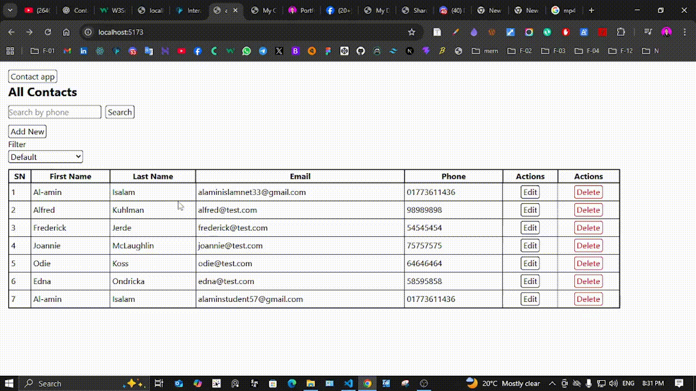

# 📓 Contact App (React)

# Assignment: -05
### Name: Al-amin Islam
### Email: alaminstudent57@gmail.com
[Live URL](https://alamin-codes.github.io/portfolio/)

A simple Contact Management Application built with **React**, **React Router**, and **JSON Server**. You can **add, edit, delete, search, and filter contacts** easily.

---

## 🚀 Features :ro

- ➕ Add new contact 
- ✏️ Edit contact (prefilled form)
- ✖️ Delete contact (with confirmation) 
- 🔍 Search contact with phone number
- 🎯 Filter contacts
    - First Name (A - Z)
    - Last Name (A - Z)
    - Oldest to Newest
- ⌚ Client-side routing using React Router
- 💾 Data stored using JSON Server (fake REST API)

---

## 🛠️ Technologies Used

- React 
- React Router DOM
- JavaScript (ES6)
- HTML & CSS / Tailwind CSS
- JSON Server

---

## 📁 Project Structure
```bash
assingment_14/
├─ backend/
│  └─ db.json
├─ public/
├─ src/
│  ├─ assets/
│  ├─ components/
│  │  ├─ AddContact.jsx
│  │  ├─ EditContact.jsx
│  │  ├─ Filter.jsx
│  │  └─ Search.jsx
│  ├─ hoocks/
│  │  └─ useContacts.js
│  ├─ App.jsx
│  ├─ index.css
│  └─ main.jsx
├─ .gitignore
├─ eslint.config.js
├─ index.html
├─ package-lock.json
├─ package.json
├─ README.md
└─ vite.config.js
```

---

## ⚙️ Installation & Setup

### 1. Clone the repository

```bash
git clone https://github.com/alamin-codes/contact-app.git

```
```
cd contact-app
```
### 2. Install dependencies

```
npm install
```

### 3. Start JSON Server
```
npx json-server --watch backend/db.json --port 3001
```
### 4. Run React app
```
npm run dev
```

## 🧠 Learning Outcome

- React state management
- Custom hooks
- React Router
- CRUD operation
- Search & filter logic
- Component-based architecture

## 🦸 Author
### Al-amin Islam
## 🌐 Live Portfolio 

🔗 [https://alamin-codes.github.io/portfolio/](https://alamin-codes.github.io/portfolio/)


## 💻 Github

🔗 [https://github.com/alamin-codes](https://github.com/alamin-codes)

## 📸 App Preview

<p align="center">
  
</p>